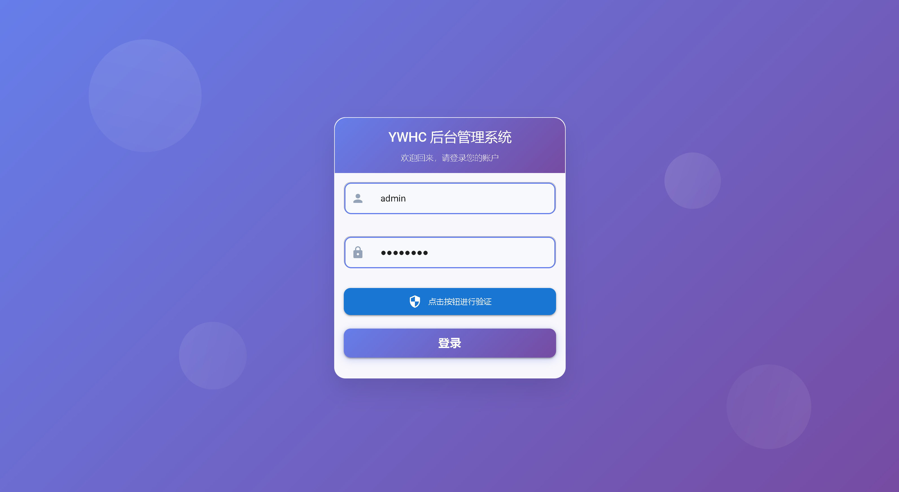
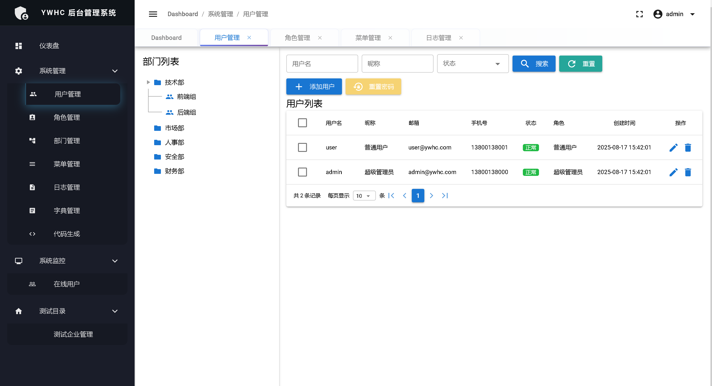
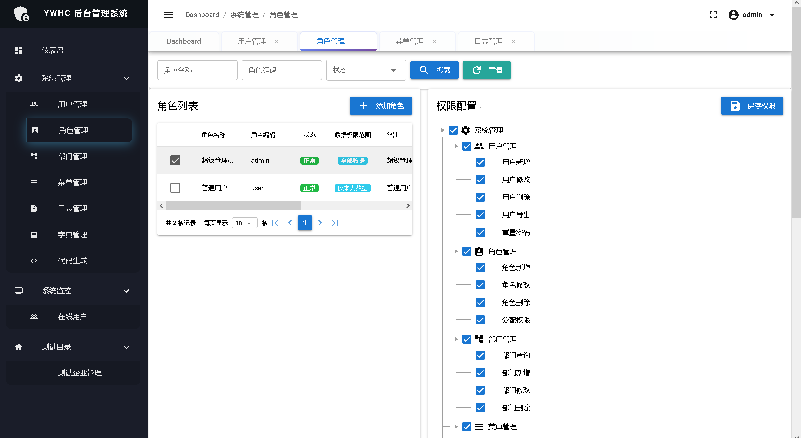
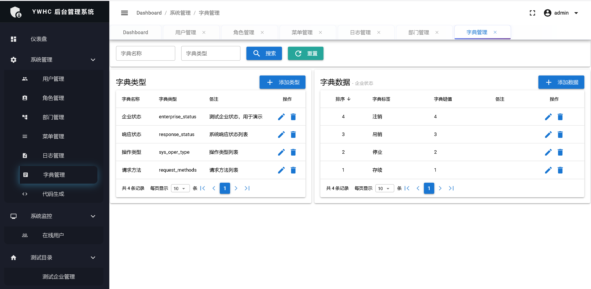
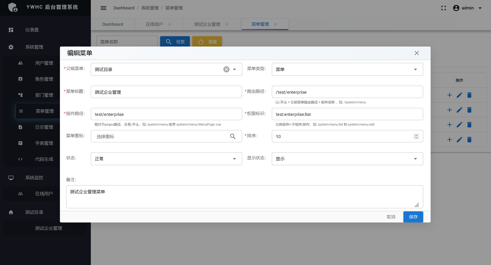
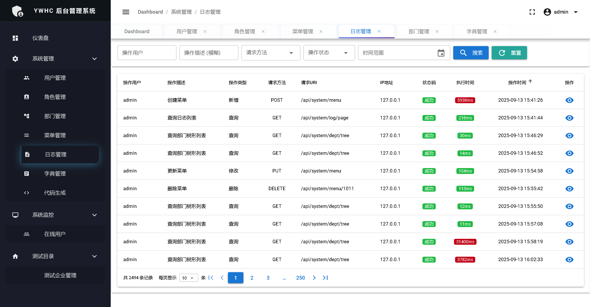
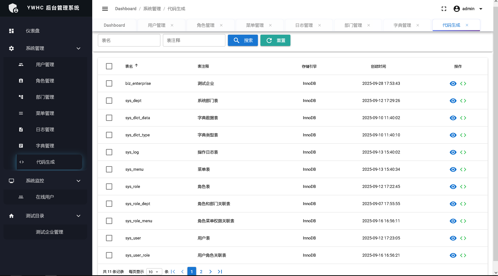
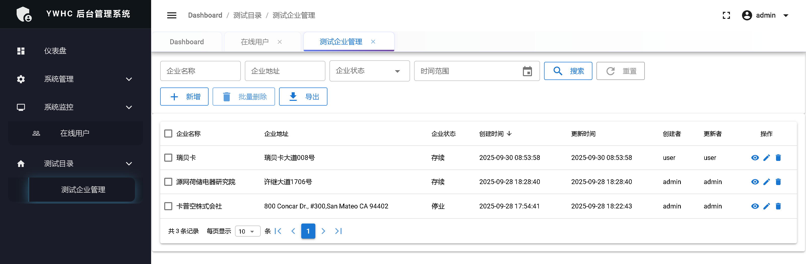

## 项目介绍 - 后端

一个基于 Spring Boot 3.2、Java 21、Spring Security、MyBatis Plus、JWT、Quasar Framework V2（Vue3） 构建的现代化企业级后台管理系统。

## 🌐 语言 / Language

**中文** | [English](README-en.md)

## 🔗 快速导航

| 项目 | 描述 | 链接 |
|------|------|------|
| 🖥️ **后端项目** | Spring Boot3 后端服务 | [ywhc-admin-backend](https://github.com/your-org/ywhc-admin/tree/main/ywhc-admin-backend) |
| 🌐 **前端项目** | Vue3 + Quasar Framework 前端应用 | [ywhc-admin-frontend](https://github.com/your-org/ywhc-admin/tree/main/ywhc-admin-frontend) |


## 📋 功能特性

- 👥 **用户管理** - 用户相关配置，默认密码admin123
- 🏢 **部门管理** - 组织架构管理，树形表格形式
- 🎯 **角色权限** - 灵活的 RBAC 权限控制
- 📊 **数据权限** - 数据范围控制（全部/部门/部门及以下/仅本人）
- 📋 **菜单管理** - 动态菜单配置，前端动态菜单路由
- 🔐 **用户认证与授权** - 基于 JWT 的安全认证体系
- 📝 **操作日志** - 完整的系统操作审计
- 📚 **数据字典** - 系统配置管理
- 🖼️ **滑块验证码** - 安全的图形验证
- 📈 **在线用户监控** - 实时用户状态管理
- 📊 **代码生成** - 代码预览、下载，生成前后端代码

## 🛠️ 技术栈

- **Spring Boot** 3.2.0 - 应用框架
- **Spring Security** 6.x - 安全框架
- **MyBatis Plus** 3.5.5 - ORM 框架
- **MySQL** 8.0+ - 关系型数据库
- **JWT** 0.12.3 - JSON Web Token
- **Hutool** 5.8.22 - Java 工具类库
- **Apache POI** 5.2.4 - Excel 操作
- **Jackson** - JSON 处理
- **Knife4j** 4.3.0 - API 文档生成
- **Freemarker** - 模板引擎
- **Quasar Framework v2** - 前端Vue3框架

## 📋 环境要求

### 必需环境
- **JDK** 21 或更高版本
- **Maven** 3.6+ 
- **MySQL** 8.0+
- **Redis** 6.0+

## 📁 项目结构
```
ywhc-admin-backend/
├── src/main/java/com/ywhc/admin/
│   ├── YwhcAdminApplication.java    # 启动类
│   ├── common/                      # 公共模块
│   │   ├── annotation/              # 自定义注解
│   │   ├── aspect/                  # 切面处理
│   │   ├── config/                  # 公共配置
│   │   ├── context/                 # 上下文管理
│   │   ├── dto/                     # 公共DTO
│   │   ├── enums/                   # 枚举类
│   │   ├── exception/               # 异常处理
│   │   ├── interceptor/             # 拦截器
│   │   ├── result/                  # 统一返回结果
│   │   ├── security/                # 安全相关
│   │   ├── task/                    # 定时任务
│   │   ├── util/                    # 工具类
│   │   └── utils/                   # 工具类
│   └── modules/                     # 业务模块
│       ├── auth/                    # 认证模块
│       ├── captcha/                 # 验证码模块
│       ├── generator/               # 代码生成模块
│       ├── monitor/                 # 系统监控模块
│       ├── system/                  # 系统管理模块
│       │   ├── dept/                # 部门管理
│       │   ├── dict/                # 字典管理
│       │   ├── log/                 # 日志管理
│       │   ├── menu/                # 菜单管理
│       │   ├── role/                # 角色管理
│       │   └── user/                # 用户管理
│       └── test/                    # 测试模块
├── src/main/resources/
│   ├── mapper/                      # MyBatis XML 映射文件
│   │   ├── system/                  # 系统模块映射文件
│   │   └── test/                    # 测试模块映射文件
│   ├── templates/                   # 代码生成模板
│   │   ├── controller.java.ftl      # 控制器模板
│   │   ├── entity.java.ftl          # 实体类模板
│   │   ├── mapper.java.ftl          # Mapper模板
│   │   ├── service.java.ftl         # 服务类模板
│   │   ├── vue-page.vue.ftl         # Vue页面模板
│   │   └── ...                      # 其他模板文件
│   ├── application.yml              # 主配置文件
│   ├── application-dev.yml          # 开发环境配置
│   └── application-prod.yml         # 生产环境配置
├── src/test/                        # 测试代码
└── pom.xml                          # Maven 配置文件
```

## 📸 系统截图

### 登录界面


### 用户界面


### 角色界面


### 字典界面


### 菜单界面


### 日志界面


### 代码生成功能


### 业务示例


## 📄 许可证

本项目基于 MIT 许可证开源 - 查看 [LICENSE](LICENSE) 文件了解详情。

---

⭐ 如果这个项目对你有帮助，请给我一个 Star！